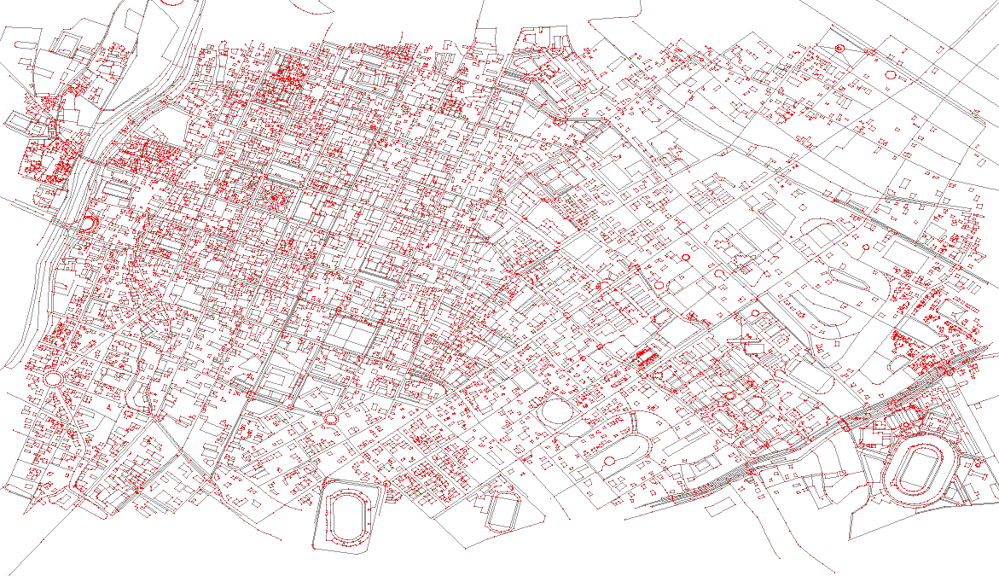
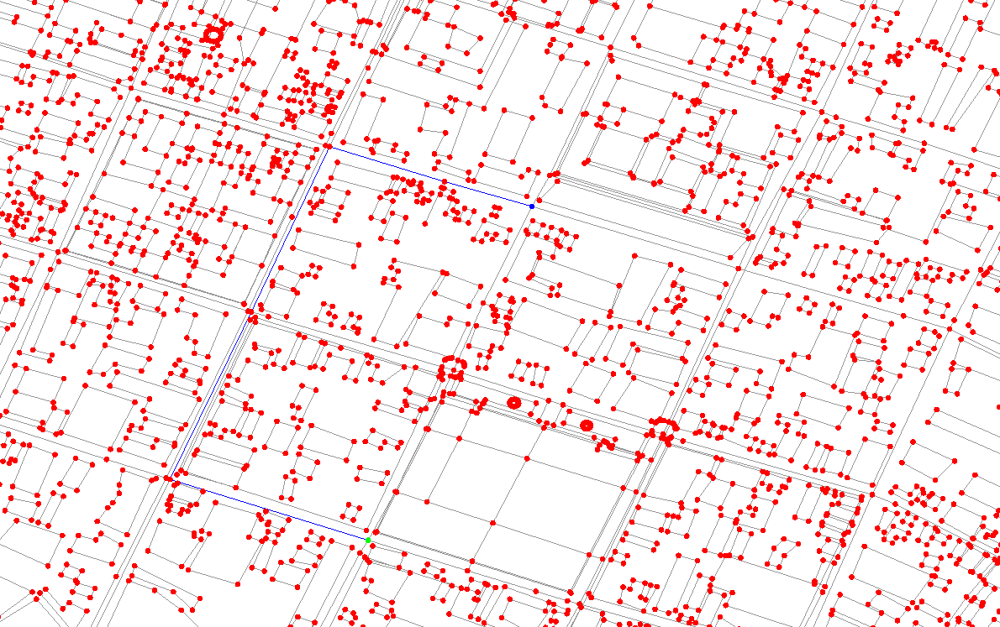
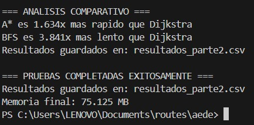
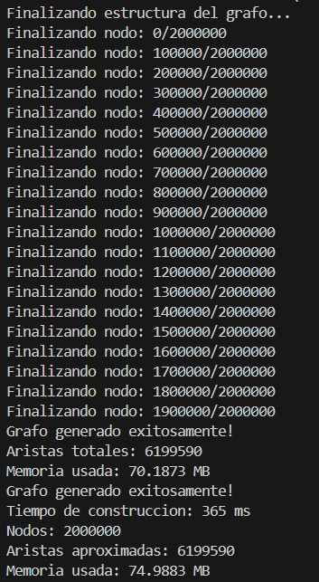
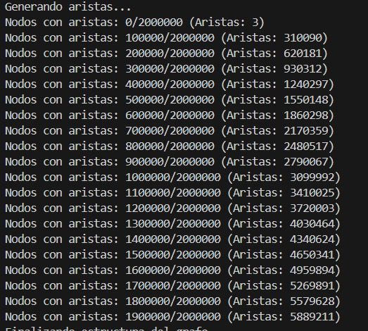
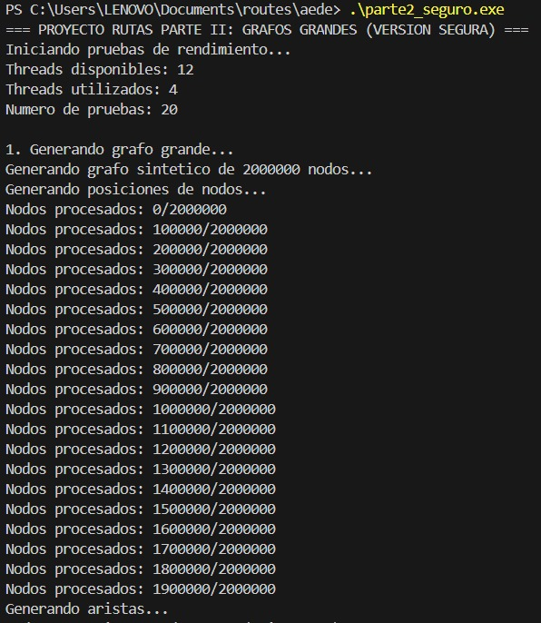

# Sistema de Navegación Arequipa

Sistema de navegación basado en grafos implementado en C++ que permite visualizar rutas sobre un mapa de Arequipa y calcular rutas óptimas entre dos puntos.

## Características

- **Implementación desde cero**: Grafos y algoritmos implementados sin usar STL
- **Visualización interactiva**: Interfaz gráfica usando SFML
- **Múltiples algoritmos de búsqueda**:
  - Breadth-First Search (BFS)
  - Depth-First Search (DFS)  
  - Best First Search
  - Dijkstra
  - A* (A-star)

## Estructura del Proyecto

```
├── estructuras.h        # Estructuras de datos (cola, cola de prioridad)
├── algoritmos.h         # Declaraciones de algoritmos
├── grafo_arequipa.h     # Datos del grafo de Arequipa (~30K nodos)
├── bfs.cpp             # Implementación BFS
├── dfs.cpp             # Implementación DFS
├── best_first_search.cpp # Implementación Best First Search
├── dijkstra.cpp        # Implementación Dijkstra
├── a_estrella.cpp      # Implementación A*
├── mapa_grafo.cpp      # Programa principal con visualización
└── arequipa_graph.json # Datos del grafo en formato JSON
```

## Compilación

### Requisitos
- Compilador C++ (g++ recomendado)
- SFML development libraries

### Usando Makefile (Linux/Mac/Windows con WSL)
```bash
make
make run
```

### Usando PowerShell (Windows)
```powershell
.\build.ps1
```

### Compilación manual
```bash
g++ -std=c++17 -O2 mapa_grafo.cpp bfs.cpp dfs.cpp best_first_search.cpp a_estrella.cpp dijkstra.cpp -o mapa_arequipa -lsfml-graphics -lsfml-window -lsfml-system
```

## Uso

1. Ejecutar el programa: `./mapa_arequipa`
2. **Seleccionar puntos**: Click izquierdo para seleccionar origen (azul) y destino (verde)
3. **Ejecutar algoritmos** usando las teclas:
   - `B`: BFS (Breadth-First Search)
   - `D`: DFS (Depth-First Search)
   - `G`: Best First Search
   - `J`: Dijkstra
   - `A`: A* (A-star)
   - `R`: Reset selección

### Controles de vista
- **Click derecho + arrastrar**: Mover vista
- **Scroll del mouse**: Zoom in/out

## Algoritmos Implementados

### BFS (Breadth-First Search)
- Encuentra el camino con menor número de aristas
- No considera pesos de las aristas
- Garantiza encontrar el camino más corto en grafos no ponderados

### DFS (Depth-First Search)  
- Búsqueda en profundidad
- No garantiza el camino óptimo
- Útil para exploración completa del grafo

### Best First Search
- Búsqueda voraz usando heurística
- Siempre elige el nodo que parece estar más cerca del objetivo
- No garantiza optimalidad

### Dijkstra
- Encuentra el camino más corto en grafos con pesos positivos
- Garantiza optimalidad
- Considera todos los pesos de las aristas

### A* (A-star)
- Combina Dijkstra con heurística
- Más eficiente que Dijkstra
- Garantiza optimalidad si la heurística es admisible

## Rendimiento

El proyecto está optimizado para manejar grafos de gran escala:
- ~30,000 nodos en el mapa de Arequipa
- Estructuras de datos eficientes implementadas desde cero
- Algoritmos optimizados para rendimiento

## Pruebas de ejecucion 



## Parte II: Grafos Grandes (2M nodos)

Para la segunda parte del proyecto (grafos de 2 millones de nodos), se pueden usar las mismas implementaciones de algoritmos, enfocándose en:
- Métricas de rendimiento
- Comparación de algoritmos
- Optimizaciones adicionales para grafos masivos

### Compilación Parte II
```bash
# Compilación optimizada para rendimiento
g++ -std=c++17 -O2 parte2_main.cpp grafo_grande.cpp algoritmos_grandes.cpp dijkstra_grande.cpp metricas.cpp -o parte2_benchmark

# O usar el script
.\build_parte2.ps1
```

### Ejecución Parte II
```bash
# Ejecutar benchmark completo
.\parte2_benchmark.exe
```

### Características de la Parte II
- **Paralelismo**: Utiliza todos los cores disponibles del CPU
- **Grafos sintéticos**: Genera grafos de 2M nodos automáticamente
- **Métricas detalladas**: Tiempo, memoria, calidad de rutas
- **Exportación**: Resultados en CSV y reportes HTML
- **Algoritmos optimizados**: Estructuras de datos sin STL, optimizadas para memoria

### Pruebas de la ejecucion de la segunda parte 






### Métricas Medidas
- Tiempo de construcción del grafo
- Tiempo de búsqueda por algoritmo
- Uso de memoria RAM
- Longitud de rutas encontradas
- Tasa de éxito en encontrar caminos
- Comparación de rendimiento entre algoritmos

### Requisitos para Parte II
- **RAM**: Mínimo 4 GB (recomendado 8 GB)
- **CPU**: Procesador multi-core (recomendado 4+ cores)
- **Tiempo**: 5-15 minutos dependiendo del hardware
- **Espacio**: ~500 MB para archivos de resultados
